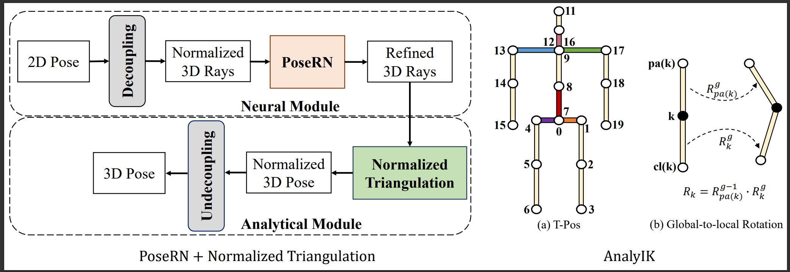

# Normalized Triangulation for Calibrated Dual-View 3D Human Pose Estimation

This repository is the official implementation of [Normalized Triangulation for Calibrated Dual-View 3D Human Pose Estimation]. 

## Key idea: Normalized Triangulation + PoseRN + AnalyIK

<div align="center">
    <br>
    Our framework
</div>

## Requirements

To install requirements:

```setup
#1. Create a conda virtual environment.
conda create -n mvhpe python=3.7.11
conda activate mvhpe

#2. Install Pytorch
pip install torch==1.8.1+cu101 torchvision==0.9.1+cu101 torchaudio==0.8.1 -f https://download.pytorch.org/whl/torch_stable.html

#3. Install requirements.
pip install -r requirements.txt
```

## Preparing Data 

1. Download the required data.
   * Download our data from [Google Drive](https://drive.google.com/drive/folders/1Z6-fLuANi2Y67w-VZrx-oG_K9IrSINtK?usp=sharing) 
   
2. You need to add the `data` and  `checkpoint` as below.
```
|-- data
`-- |-- h36m_sub1.npz
    `-- ...
    `-- h36m_sub11.npz
```

## Training

## License
By downloading and using this code you agree to the terms in the [LICENSE](LICENSE). Third-party datasets and software are subject to their respective licenses.


