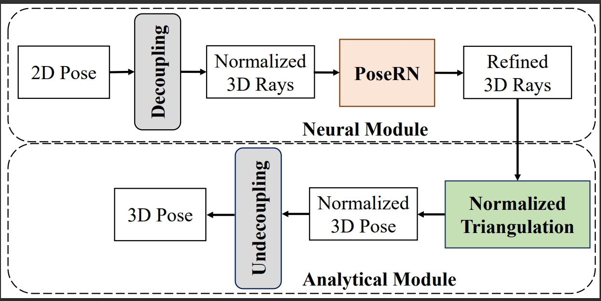

# Normalized Triangulation for Calibrated Dual-View 3D Human Pose Estimation

This repository is the official implementation of [Normalized Triangulation for Calibrated Dual-View 3D Human Pose Estimation]. 

## Key idea: Normalized Triangulation + PoseRN + AnalyIK

     
    Our framework

